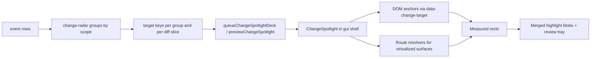

# Agent Changesets And Review Spotlight

This is the canonical reference for Marble's agent-change review system.

If you are touching the change radar, review spotlight, sidebar preview, or any resource-specific highlight behavior, read this first.

## The Short Version

The system does **not** guess from pixels or screenshots.

It works because every changed thing is reduced to a small, canonical target key such as:

- `project:<id>`
- `table:<id>`
- `row:<id>`
- `column:<id>`
- `cell:<rowId>:<columnId>`
- `program:<id>`
- `program-file:<programId>:<filename>`
- `program-version:<id>`
- `profiles`

Those keys are then matched to one of two things:

1. A real DOM element that opted in with `data-change-target`.
2. A route-level resolver that knows how to reveal and find the real element for virtualized or indirect surfaces.

That is why the highlights can be exact without the shell needing route-specific UI knowledge.

## Mental Model

There are only three real layers:

1. `change-radar`
   Reads `event` rows, groups them into reviewable changesets, and emits target keys.
2. Route surfaces
   Expose exact targets with `getChangeTargetProps(...)`, and optionally register a resolver if the DOM is virtualized.
3. `ChangeSpotlight`
   Lives once in the shell, consumes queued groups, finds visible targets, merges adjacent rects, and paints the overlay.

Everything else is presentation.

## System Flow

## The Important Files

- `apps/web/src/app/(gui)/change-radar.tsx`
- `apps/web/src/app/(gui)/change-spotlight.tsx`
- `apps/web/src/app/(gui)/gui-shell.tsx`
- `apps/web/src/app/(gui)/tables/[id]/view.tsx`
- `packages/ui/src/components/activity-radar.tsx`
- `packages/ui/src/components/review-navigator.tsx`

## Core Primitives

### `changeTargetKey`

Defined in `change-spotlight.tsx`.

This is the canonical encoder for review targets. Do not invent ad hoc string formats elsewhere.

### `getChangeTargetProps(targetKey)`

This adds the `data-change-target` attribute to a rendered element.

Use it on the most exact meaningful surface:

- exact cell, not the whole grid
- exact file row, not the whole pane
- exact project row, not the whole page shell

### `useChangeSpotlightResolver(resolver)`

Use this when the target cannot be found reliably with plain DOM queries.

This is required for virtualized surfaces like AG Grid, where the cell may not exist in the DOM until the grid scrolls it into view.

Resolvers are allowed to:

- reveal a target
- find the exact element after reveal
- keep route-specific lookup logic out of the shell

### `queueChangeSpotlightDeck(...)`

Queues one or more grouped changesets for review navigation.

The review tray dots navigate across these grouped changesets, not across every individual cell.

### `previewChangeSpotlight(...)`

Used for non-committal hover preview.

This powers both:

- hover preview in the `Agent changesets` popover
- off-page preview via the sidebar

## Why Tables Can Be Exact

Tables are the hardest surface because AG Grid virtualizes rows and cells.

The table route solves this by doing both:

1. Registering exact DOM anchors on headers, row-number cells, and rendered cells.
2. Registering a spotlight resolver that can:
   - reveal the target with grid APIs
   - wait for render
   - find the exact `.ag-cell` or `.ag-header-cell`

That is the pattern to copy for any future virtualized surface.

The shell should never learn AG Grid internals.

## Why The Highlight Is Sometimes A Blob

The spotlight intentionally merges adjacent measured rects into contiguous shapes where possible.

That keeps grouped changes readable:

- a dense row cluster should feel like one changed region
- a column cluster should feel like one changed region
- hovering a diff slice can still narrow the spotlight to just that subset

The rule is:

- exact first
- merged second
- broad fallback last

Never start from a broad wrapper if exact targets are available.

## What The Review Tray Actually Does

The bottom review tray is not decorative.

It has two jobs:

1. Navigate across recent grouped changesets.
2. Let the user inspect a subset of the active group by hovering a category or diff chip.

Examples:

- Hover `20 cells` to narrow the spotlight to the cell targets in the active changeset.
- Hover `+12` to narrow it to the create targets for that category.
- Move off the tray to restore the full active-group highlight.

This is why `change-radar` carries target subsets per resource and per operation, not just one flat array per group.

## Sidebar Preview

If a hovered changeset does not belong to the detail page you are currently on, the shell does not silently fail.

Instead:

- the sidebar temporarily opens the relevant branch
- the matching node is highlighted there
- the page-level preview still uses the same target-key protocol

That keeps the system unified across current-page and off-page preview.

## Guardrails

Do not regress these rules:

1. Do not highlight panes just because they are easy to find.
2. Do not make the shell infer route structure from resource names.
3. Do not invent a second target-key format.
4. Do not add bespoke review chrome in `apps/web` if the primitive belongs in `packages/ui`.
5. Do not collapse a cell-heavy table changeset down to column headers unless exact cell targets are genuinely unavailable.
6. Do not navigate dots through individual cells inside a group. Dots are for grouped changesets.
7. Do not add ornamental status badges or explanatory labels that narrate obvious UI structure.

## Adding A New Resource Surface

When adding spotlight support for a new resource, follow this order:

1. Decide the canonical target key shape.
2. Add exact DOM anchors with `getChangeTargetProps(...)`.
3. Add a resolver only if the surface is virtualized or indirect.
4. Teach `change-radar` how to derive:
   - group-level target keys
   - resource-level detail target keys
   - operation-level detail target keys
5. Ensure off-page hover preview has a sensible sidebar or ancestor fallback.
6. Verify the tray, preview, and click-through all point at the real resource.

## Complexity Budget

This system is intentionally moderate, not magic.

The complexity is capped because:

- the shell owns orchestration once
- pages only expose anchors or resolvers
- target keys are the shared contract

If future work starts pushing logic back into page-specific spotlight UIs, the system is drifting in the wrong direction.

## Regression Checklist

Before shipping changes here, verify all of the following:

- clicking a changeset navigates to the real resource, not `/events`
- hover preview works on the current page
- off-page hover preview has a visible fallback, usually in the sidebar
- exact targets win over broad wrappers
- diff chips can narrow the active spotlight
- clicking outside the spotlight exits review mode
- the unread adornment on the `Agent changesets` trigger stays accurate
- `apps/web/src/app/internal/ui/page.tsx` still demonstrates the shared primitives if their behavior changed materially
